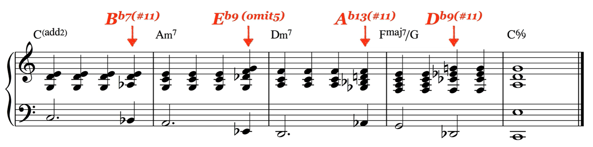

# ep28-30 副属和弦
1. 原理：属七和弦想要解决到主和弦，如果把目标和弦当作暂时的“家”，那么在且换和弦中间插入一个副属和弦，就可以得到不错的效果。$C\to Em$就可以换成$C \to B_{7} \to Em$，其中$B_{7}$是$Em$小调的属七和弦。
   
2. （进阶慎用）降2代5：用高半音的属七/九/十一和弦代替目标和弦的属七和弦，例如$C\to B_{7} \to Em$可以换成$C \to F^b_{7} \to Em$。
   
3. 接1，将目标和弦当作“家”，在目标和弦之前插入一个副属和弦（V级）再在副属和弦之前插入一个“桥”（II级），这样听感更流行。$C \to F^{maj_{7}}$就可以换成$C \to Gm^7 \to C^7 \to F^{maj7}$
   
   注意，当目标和弦是小和弦时，在前面装饰的二级和弦需要变成一个半减七和弦（小三度+小三度+大三度）
   eg：$C \to Am$变成$C \to  B^{\varnothing}_7 \to E_{7} \to Am$
   很有流行的味道!
